# Audit S3 Buckets for Public Access and Notify Using AWS Lambda

## Project Overview

This project automates the auditing of Amazon S3 buckets to identify buckets that are publicly accessible and sends notifications using Amazon SNS.

As of April 2023, AWS enables Block Public Access and disables ACLs by default for newly created buckets. Therefore, this solution performs multiple security checks instead of relying solely on ACL permissions.

The Lambda function examines:

- Block Public Access configuration
- Bucket policy status
- Bucket ACL permissions

If any bucket is found to be public or has Block Public Access disabled, an SNS email notification is sent automatically.

---

## Objective

Detect publicly accessible S3 buckets and notify administrators automatically.

---

## Architecture

```text
                     +----------------------+
                     |   Amazon EventBridge |
                     |    (Daily Schedule)  |
                     +----------+-----------+
                                |
                                v
                     +----------------------+
                     |     AWS Lambda       |
                     |    (Python 3.12)     |
                     +----------+-----------+
                                |
        +-----------------------+-----------------------+
        |                       |                       |
        v                       v                       v
+----------------+   +----------------------+   +----------------+
| Block Public   |   | Bucket Policy Check |   | Bucket ACL     |
| Access Check   |   | (IsPublic Status)   |   | Validation     |
+----------------+   +----------------------+   +----------------+
                                |
                                v
                     +----------------------+
                     |      Amazon SNS      |
                     |    Email Alert       |
                     +----------------------+
```

---

# AWS Services Used

- Amazon S3
- AWS Lambda
- Amazon SNS
- Amazon EventBridge
- AWS IAM
- Amazon CloudWatch
- Boto3 (AWS SDK for Python)

---

# Project Workflow

1. Create an SNS topic.
2. Subscribe an email address to the topic.
3. Create an IAM role for Lambda.
4. Deploy the Lambda function.
5. Lambda lists all S3 buckets in the account.
6. For each bucket, Lambda checks:
   - Block Public Access configuration.
   - Bucket policy status.
   - ACL permissions.
7. If a bucket is public, an SNS notification is sent.
8. EventBridge triggers the Lambda function every day.

---

# IAM Policy

Attach the following inline policy to the Lambda execution role.

```json
{
    "Version": "2012-10-17",
    "Statement": [
        {
            "Sid": "S3AuditPermissions",
            "Effect": "Allow",
            "Action": [
                "s3:ListAllMyBuckets",
                "s3:GetBucketPublicAccessBlock",
                "s3:GetBucketPolicyStatus",
                "s3:GetBucketAcl"
            ],
            "Resource": "*"
        },
        {
            "Sid": "SNSPublishPermission",
            "Effect": "Allow",
            "Action": [
                "sns:Publish"
            ],
            "Resource": "arn:aws:sns:<region>:<account-id>:<topic-name>"
        }
    ]
}
```

Replace:

```text
<region>
<account-id>
<topic-name>
```

with your SNS topic details.

---

# Lambda Function (Python 3.12)

```python
import boto3

s3 = boto3.client("s3")
sns = boto3.client("sns")

SNS_TOPIC_ARN = "YOUR_SNS_TOPIC_ARN"


def lambda_handler(event, context):

    buckets = s3.list_buckets()["Buckets"]

    public_buckets = []

    for bucket in buckets:

        bucket_name = bucket["Name"]

        is_public = False

        # Check Block Public Access

        try:

            response = s3.get_public_access_block(
                Bucket=bucket_name
            )

            config = response[
                "PublicAccessBlockConfiguration"
            ]

            if not all(config.values()):
                is_public = True

        except Exception:
            is_public = True

        # Check bucket policy

        try:

            policy = s3.get_bucket_policy_status(
                Bucket=bucket_name
            )

            if policy["PolicyStatus"]["IsPublic"]:
                is_public = True

        except Exception:
            pass

        # Check ACL

        try:

            acl = s3.get_bucket_acl(
                Bucket=bucket_name
            )

            for grant in acl["Grants"]:

                grantee = grant.get(
                    "Grantee", {}
                )

                if (
                    grantee.get("URI")
                    == "http://acs.amazonaws.com/groups/global/AllUsers"
                ):
                    is_public = True

        except Exception:
            pass

        if is_public:

            public_buckets.append(
                bucket_name
            )

    if public_buckets:

        message = (
            "Public S3 buckets detected:\n\n"
            + "\n".join(public_buckets)
        )

        sns.publish(
            TopicArn=SNS_TOPIC_ARN,
            Subject="S3 Public Bucket Alert",
            Message=message
        )

    return {
        "statusCode": 200,
        "public_buckets": public_buckets
    }
```

---

# EventBridge Schedule

Configure an EventBridge rule to trigger the Lambda function automatically.

| Property | Value |
|----------|----------|
| Rule Type | Scheduled Rule |
| Frequency | Daily |
| Target | Lambda Function |

Example cron expression:

```text
cron(0 0 * * ? *)
```

Runs every day at midnight (UTC).

---

# Testing

## Test Procedure

1. Create a test bucket.
2. Disable Block Public Access.
3. Attach a public-read bucket policy.
4. Manually invoke the Lambda function.
5. Verify that an SNS email notification is received.
6. Verify logs in CloudWatch.
7. Re-enable Block Public Access after testing.

---

# Screenshots

## 1. SNS Topic

```md
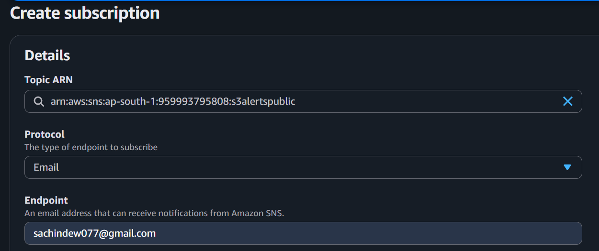
```


---

## 2. Email Subscription

```md
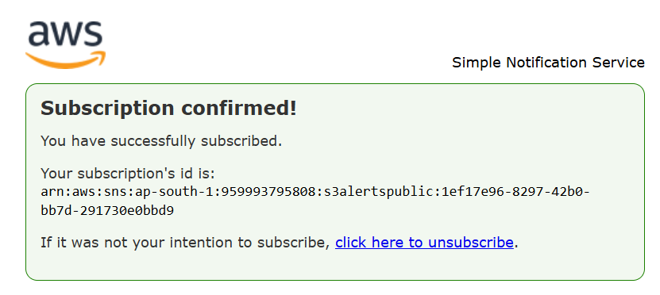
```


---

## 3. Subscription Confirmation Email

```md
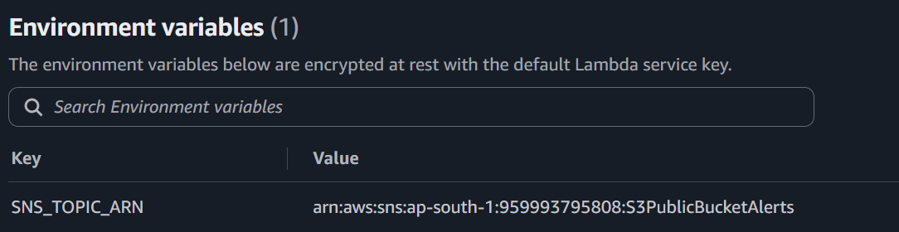
```


---

## 4. IAM Role

```md
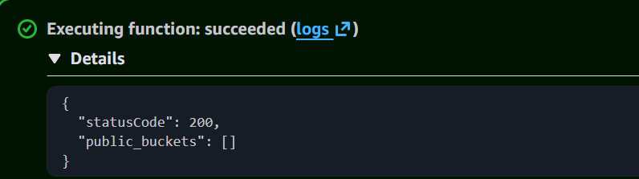
```


---

## 5. IAM Policy

```md
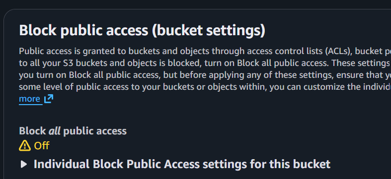
```


---

## 6. Lambda Function Code

```md
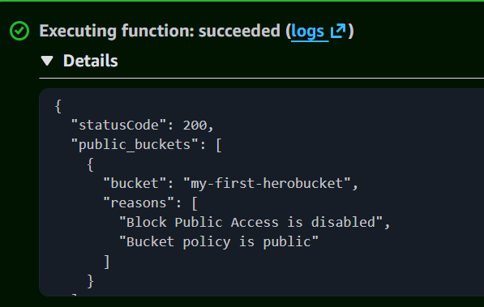
```


---

## 7. Lambda Test Event

```md
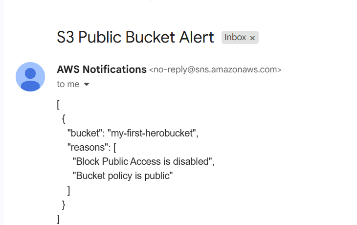
```


---

## 8. EventBridge Rule

```md
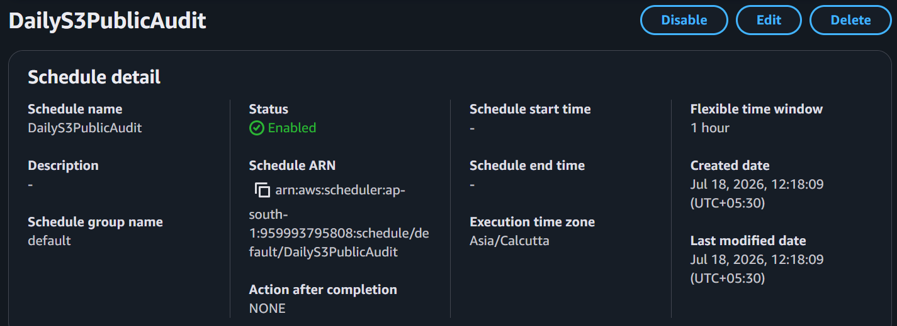
```


---

## 9. Public Bucket Policy

```md
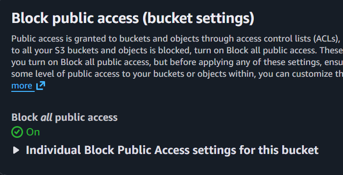
```


---

## 10. SNS Alert Email

```md
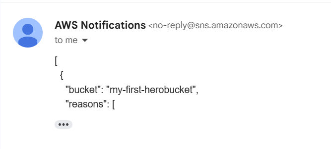
```


---

## 11. CloudWatch Logs

```md
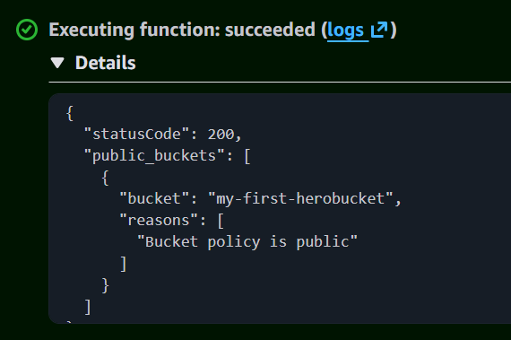
```


---

# CloudWatch Verification

Navigate to:

```text
AWS Console → CloudWatch → Log Groups → /aws/lambda/<function-name>
```

Verify that the logs contain:

```text
Public S3 buckets detected:

test-public-bucket
my-demo-bucket
```

---

# Security Best Practices

✅ Validate Block Public Access settings.

✅ Verify bucket policy status.

✅ Check ACL permissions.

✅ Follow the principle of least privilege.

✅ Schedule automated audits.

✅ Generate notifications automatically.

---

# Production Considerations

AWS Config and Security Hub provide managed compliance checks for public S3 buckets.

Lambda is useful when:

- Custom alerting logic is required.
- Multiple security checks must be combined.
- Notifications need to integrate with other AWS services.
- Additional remediation actions are needed.

---

# Repository Structure

```text
audit-s3-public-access/
│
├── lambda_function.py
├── policy.json
├── README.md
│
└── screenshots/
    ├── 1.png
    ├── 2.png
    ├── 3.png
    ├── 4.png
    ├── 5.png
    ├── 6.png
    ├── 7.png
    ├── 8.png
    ├── 9.png
    ├── 10.png
    └── 11.png
```

---
